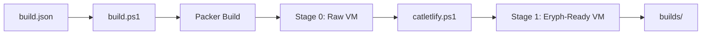

# Hyper-V Boxes for Eryph

Build cloud-ready Hyper-V virtual machine templates optimized for the [Eryph](https://github.com/eryph-org/eryph) virtualization platform.

## Overview

This repository creates base VM templates (catlets) that are published to the Eryph genepool. These templates serve as foundational images for Eryph users to inherit from when creating their catlets. All VMs are cloud-init/cloudbase-init enabled for dynamic configuration.

## Features

- **Cloud-Ready**: Pre-configured with cloud-init (Linux) or cloudbase-init (Windows)
- **Optimized for Eryph**: Linux-style naming conventions, migration compatibility
- **Automated Building**: Packer-based automation with PowerShell orchestration
- **Wide OS Support**: Ubuntu LTS, Windows Server 2016-2025, Windows 10/11

## Quick Start

### Prerequisites

- Windows with Hyper-V enabled
- PowerShell 5.1 or later
- Sufficient disk space (~50GB per template)
- Internet connection for ISO downloads

### Building Templates

```powershell
# List available templates
.\list.ps1

# Build a specific template
.\build.ps1 -Filter "ubuntu-22.04"

# Build multiple templates
.\build.ps1 -Filter "ubuntu-*"

# Build all templates
.\build.ps1
```

### Output

Built VMs are placed in the `builds/` directory as:
- Hyper-V VMs with `.vhdx` disks
- Metadata JSON files for Eryph integration
- Ready for packing and publishing to genepool

## Supported Operating Systems

### Linux
| OS | Versions | Status |
|---|---|---|
| Ubuntu LTS | 20.04, 22.04, 24.04 | ✅ Production |
| Ubuntu | 25.04 | ✅ Development |

### Windows Server
| Edition | Versions | Variants |
|---|---|---|
| Standard | 2016, 2019, 2022, 2025 | Full, Core |
| Datacenter | 2016, 2019, 2022, 2025 | Full, Core |

### Windows Desktop
| OS | Versions | Edition |
|---|---|---|
| Windows 10 | 2004, 20H2 | Enterprise |
| Windows 11 | 21H1, 22H2, 24H2 | Enterprise |

## Architecture

### Build Pipeline



### Two-Stage Process

1. **Stage 0**: Packer builds the base VM
   - Unattended OS installation
   - Cloud-init/cloudbase-init setup
   - Initial provisioning

2. **Stage 1**: Eryph optimization
   - Rename drives (sda, sdb, sdc)
   - Rename network adapters (eth0, eth1)
   - Enable processor compatibility
   - Export metadata

## Configuration

### Template Structure

```
templates/
├── ubuntu/
│   ├── ubuntu-autoinstall.pkr.hcl      # Main template
│   ├── ubuntu-22.04.pkrvars.hcl        # Version variables
│   └── provisioning/                    # Setup scripts
└── windows/
    ├── windows.pkr.hcl                  # Main template
    ├── windows-2022.pkrvars.hcl        # Version variables
    └── chef/                            # Configuration recipes
```

### Customization

Fork this repository to create custom templates:

1. Modify `.pkrvars.hcl` files for version-specific settings
2. Update provisioning scripts in `templates/*/provisioning/`
3. Adjust `build.json` to add new templates
4. Run `.\build.ps1` to test your changes

## Integration with Eryph

### As Base Catlets

These templates are published to the Eryph genepool as:
```
dbosoft/ubuntu-22.04/latest
dbosoft/windows-2022/latest
```

Users inherit from these in their catlet definitions:
```yaml
parent: dbosoft/ubuntu-22.04/latest
```

### Naming Conventions

Eryph requires Linux-style naming for cross-platform consistency:
- **Drives**: `sda`, `sdb` (not `C:`, `D:`)
- **Network**: `eth0`, `eth1` (not `Ethernet`)

## Development

### Project Structure

```
hyperv-boxes/
├── build.json           # Template definitions
├── build.ps1            # Build orchestrator
├── list.ps1             # Template listing
├── tools/
│   ├── packer.exe       # Packer binary
│   ├── catletlify.ps1   # Eryph optimizer
│   └── oscdimg.exe      # ISO creator
├── templates/           # OS templates
├── packer_cache/        # ISO cache
└── builds/              # Output VMs
```

### Repacking Existing VMs

The `repack.ps1` script allows you to convert existing Hyper-V VM exports into Eryph-ready templates. This is useful for:
- Repackage catlets build via eryph as custom base catlets 
- Creating templates from manually configured VMs
- Migrating existing infrastructure to Eryph

#### Usage

```powershell
# Basic usage with auto-detected settings
.\repack.ps1 -ExportPath "C:\VMExports\MyVM" -OSType ubuntu

# Windows VM with custom credentials
.\repack.ps1 -ExportPath "C:\Exports\WinServer" -OSType windows `
             -Username "Administrator" -Password "MyPassword123!"

# Custom output name and switch
.\repack.ps1 -ExportPath "C:\Exports\Ubuntu" -OSType ubuntu `
             -OutputName "my-ubuntu-base" -SwitchName "External"

# Minimal cleanup for faster processing
.\repack.ps1 -ExportPath "C:\Exports\MyVM" -OSType linux `
             -MinimalCleanup

# Override VM settings (memory, CPU, etc.)
.\repack.ps1 -ExportPath "C:\Exports\Server" -OSType windows `
             -VMOverridesPath ".\my-overrides.json"
```

#### VM Overrides

You can customize VM settings by providing a `vm-overrides.json` file:

```json
{
  "vm": {
    "MemoryStartup": 8589934592,    // 8GB in bytes
    "ProcessorCount": 4,
    "DynamicMemoryEnabled": false
  },
  "security": {
    "TpmEnabled": false
  }
}
```

Without `-VMOverridesPath`, the repacked VM preserves its original settings.

#### Parameters

| Parameter | Description | Required | Default |
|-----------|-------------|----------|----------|
| `-ExportPath` | Path to Hyper-V VM export directory | Yes | - |
| `-OSType` | OS type: `windows`, `ubuntu`, or `linux` | Yes | - |
| `-OutputName` | Custom name for output VM | No | `{OSType}-repack-{timestamp}` |
| `-Username` | VM admin username for cleanup | No | Administrator (Windows) / packer (Linux) |
| `-Password` | VM admin password | No | Default passwords (prompts warning) |
| `-SwitchName` | Hyper-V switch name | No | Auto-detected external switch |
| `-MinimalCleanup` | Skip non-essential cleanup tasks | No | False |
| `-VMOverridesPath` | Path to vm-overrides.json for custom settings | No | - |
| `-SkipDiskMerge` | Skip merging VHDX parent/child chains | No | False |

#### Process

1. **Disk Merge**: Automatically merges VHDX parent/child chains into single disks
2. **Import**: Imports the exported VM into Hyper-V
3. **Cleanup**: Runs OS-specific cleanup (sysprep, cloud-init reset, etc.)
4. **Optimization**: Applies Eryph naming conventions and settings
5. **Export**: Creates ready-to-use template in `builds/` directory

#### Disk Chain Merging

The repack process automatically detects and merges VHDX disk chains (differencing disks) into single disks. This is essential for creating proper base templates. The merge process:
- Detects parent/child relationships in exported VMs
- Safely merges all chains into single VHDX files
- Preserves the original filenames to maintain VM references
- Creates temporary backups during merge for safety

You can also use the merge tool standalone:
```powershell
# Check for disk chains (preview mode)
.\tools\merge-vhdx-chain.ps1 -ExportPath "C:\VMExports\MyVM" -WhatIf

# Merge disk chains
.\tools\merge-vhdx-chain.ps1 -ExportPath "C:\VMExports\MyVM"
```

### Testing

Built VMs can be tested using the [eryph-genes](https://github.com/eryph-org/eryph-genes) repository:

```powershell
# In eryph-genes repo
.\test_packed.ps1 -Gene "ubuntu-22.04"
```

### Contributing

1. Fork the repository
2. Create a feature branch
3. Test your changes locally
4. Submit a pull request

## Related Projects

- [Eryph](https://github.com/eryph-org/eryph) - The virtualization platform
- [Eryph-Genes](https://github.com/eryph-org/eryph-genes) - Build and publish pipeline
- [Eryph-Packer](https://github.com/eryph-org/eryph-packer) - Gene packaging tool

## License

This project is licensed under the MIT License - see the [LICENSE](LICENSE) file for details.

## Support

- **Documentation**: [Eryph Docs](https://docs.eryph.io)
- **Issues**: [GitHub Issues](https://github.com/eryph-org/hyperv-boxes/issues)
- **Community**: [Eryph Discussions](https://github.com/orgs/eryph-org/discussions)

## Acknowledgments

- [HashiCorp Packer](https://www.packer.io/) for VM automation
- [Chef](https://www.chef.io/) for Windows configuration management
- [Cloud-Init](https://cloud-init.io/) and [Cloudbase-Init](https://cloudbase.it/cloudbase-init/) for cloud configuration
