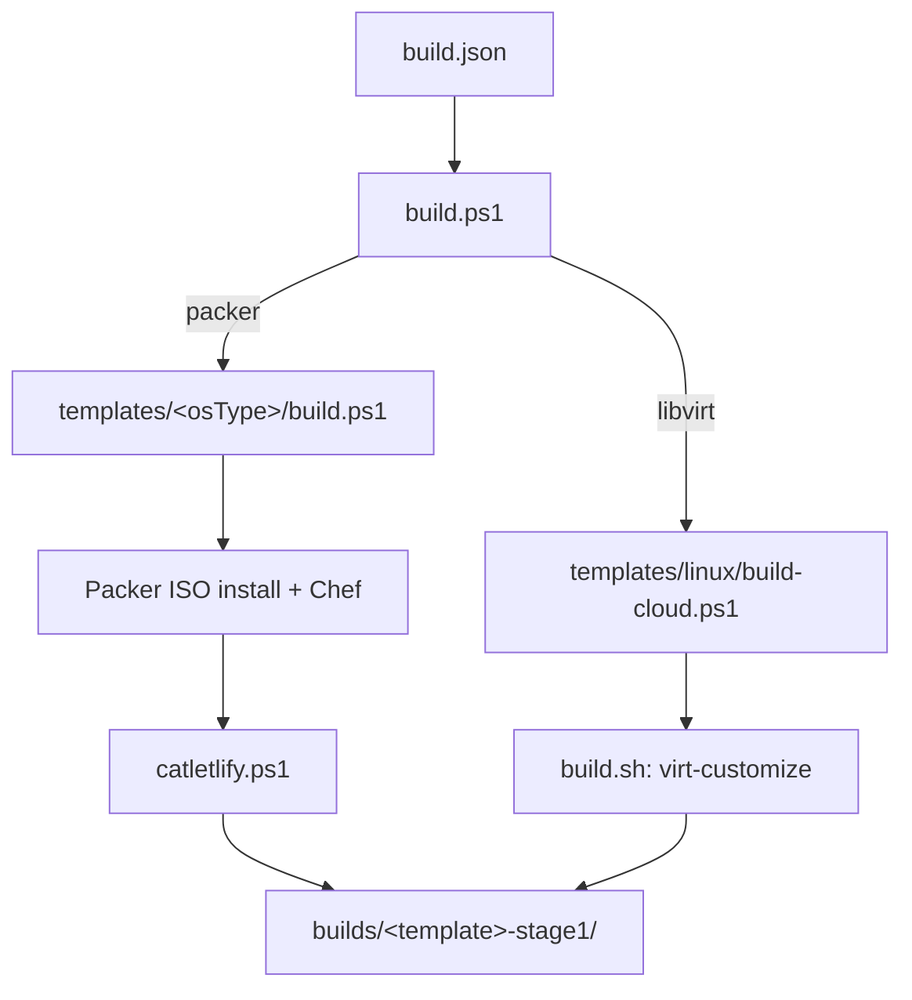

# Hyper-V Boxes for Eryph

Build cloud-ready VM templates optimized for the [Eryph](https://github.com/eryph-org/eryph) virtualization platform — published to the Eryph genepool as base catlets that users inherit from.

## Overview

This repository produces base VM templates in two complementary flows:

- **Packer** for OS installers that need an answer-file install (Windows, Oracle Linux). Boots an ISO, drives unattended setup, runs Chef/provisioning, then `catletlify.ps1` post-processes the VM for Eryph.
- **cloud-image-customize** for distros that publish ready-to-go cloud images (Ubuntu, AlmaLinux). Downloads the upstream cloud image, applies offline customizations via `virt-customize`, and emits both a Hyper-V variant (`sda.vhdx`) and a KVM/qcow2 variant (`sda.qcow2`) from one run.

All Windows images use [eryph-guest-services](https://github.com/eryph-org/guest-services) (EGS) instead of cloudbase-init; Linux images use cloud-init plus EGS.

## Features

- **Cloud-ready**: EGS + cloud-init pre-configured so Eryph's fodder system works on first boot.
- **Optimized for Eryph**: Linux-style device naming (sda/eth0), processor migration compatibility, metadata for `eryph-packer`.
- **Two output formats**: every Linux cloud-image build produces both Hyper-V (vhdx) and KVM (qcow2) artifacts.
- **Rebuild paths**: `repack.ps1` (Packer flow) and `build-cloud.ps1 -SourceImage` (cloud-image flow) both let you re-process an existing image without going through a full installer.
- **Wide OS support**: Ubuntu LTS, AlmaLinux 8/9/10, Oracle Linux 8/9/10, Windows Server 2016–2025, Windows 10/11.

## Quick Start

### Prerequisites

- Windows with Hyper-V enabled (for any Packer build, and for running the Linux cloud-image flow remotely against a build catlet).
- PowerShell 7.4+.
- Sufficient disk space (~50 GB per template).
- Internet access for ISO and cloud-image downloads.
- **Cloud-image flow only**: either a Linux host with `libguestfs-tools` + `qemu-utils`, or an Eryph build catlet (see [Build catlet for cloud-image flow](#build-catlet-for-cloud-image-flow)).

### Listing templates

```powershell
.\list.ps1                 # all templates
.\list.ps1 -Filter ubuntu* # filter
```

### Building templates

```powershell
# Build a specific template (flow is auto-selected from build.json)
.\build.ps1 -Filter "ubuntu-22.04"

# Build all templates of one method
.\build.ps1 -Method packer
.\build.ps1 -Method libvirt

# Build everything
.\build.ps1
```

`build.ps1` reads `build.json`, which is grouped by build method then OS type, and dispatches each template to the right flow (`packer` → `templates/<osType>/build.ps1` + `catletlify.ps1`; `libvirt` → `templates/linux/build-cloud.ps1`).

### Output

Built VMs land in `builds/<template>-stage1/`. For Packer the layout matches what `catletlify.ps1` produces (Hyper-V VM + `.vhdx`); for the cloud-image flow:

```
builds/<template>-stage1/
├── metadata.json
├── catlet.yaml
├── kvm/amd64/sda.qcow2     # KVM variant (zstd-compressed)
└── hyperv/amd64/sda.vhdx   # Hyper-V variant (Ubuntu: linux-azure + walinuxagent)
```

Both are ready for `eryph-packer` to pack and publish.

## Supported Operating Systems

| OS family | Versions | Build method |
|---|---|---|
| Ubuntu | 22.04, 24.04, 25.04 | cloud-image-customize |
| AlmaLinux | 8, 9, 10 | cloud-image-customize |
| Oracle Linux | 8, 9, 10 | Packer (installer) |
| Windows Server | 2016, 2019, 2022, 2025 (Std / StdCore / Datacenter) | Packer |
| Windows Desktop | 10 (2004, 20H2), 11 (21H1, 22H2, 24H2) Enterprise | Packer |

## Architecture

### Build dispatch



### Packer flow (Windows, Oracle)

1. **Stage 0**: Packer drives an unattended ISO install, applies Chef recipes (Windows) or kickstart provisioning (Oracle), installs EGS, runs sysprep / cloud-init reset, exports the VM.
2. **Stage 1**: `tools/catletlify.ps1` renames drives (sda/sdb), renames network adapters (eth0/eth1), enables processor migration compatibility, and emits the metadata JSON used by `eryph-packer`.

For the KVM variant of Packer-built Linux templates, `qemu-img convert` produces `sda.qcow2` alongside `sda.vhdx` — the in-disk kernel (`linux-azure` / RHEL default) works on both Hyper-V and KVM.

### cloud-image-customize flow (Ubuntu, AlmaLinux)

A single `build.sh` does the whole thing offline using libguestfs:

1. Fetch upstream cloud image with SHA256 verification (cached by hash).
2. Fetch EGS from `releases.dbosoft.eu`.
3. Common pass: family-specific resize/package ops → upload EGS + cloud-init drop-ins → cleanup (machine-id, ssh host keys, cloud-init clean) → package-cache cleanup.
4. Sparsify and emit `kvm/amd64/sda.qcow2`.
5. Optional Hyper-V pass on a clone (Ubuntu: install `linux-azure` + walinuxagent, switch to Hyper-V cloud-init datasource), sparsify, emit `hyperv/amd64/sda.vhdx`.
6. Emit `metadata.json` + `catlet.yaml`.

### Build catlet for cloud-image flow

On a Windows host (no libguestfs), `build-cloud.ps1` drives a Linux build catlet over EGS + SSH:

1. Starts the build catlet (`hyperv-boxes-build` in project `default` by default — defined by `templates/build-host/catlet.yaml`).
2. Uploads `templates/linux/` and any source image to a per-run workdir on the catlet.
3. Runs `build.sh` over SSH, streaming output back.
4. Downloads `builds/<template>-stage1/` and the build log.

One-time setup:

```powershell
New-Catlet -Name hyperv-boxes-build -ProjectName default `
  -Config (Get-Content -Raw .\templates\build-host\catlet.yaml)
```

## Configuration

### Template Structure

```
templates/
├── build-host/             # Build catlet definition (cloud-image flow)
├── linux/                  # cloud-image-customize flow
│   ├── build-cloud.ps1     # PowerShell driver (Linux native or via build catlet)
│   ├── build.sh            # bash orchestrator (libguestfs)
│   ├── lib/                # common.sh + per-family hooks (ubuntu.sh, rhel.sh)
│   └── files/              # cloud-init drop-ins, EGS systemd unit, catlet.yaml
├── rhel-compatible/        # Packer (Oracle Linux)
├── ubuntu/                 # Packer (legacy, not used by libvirt flow)
└── windows/                # Packer (Windows)
    ├── windows.pkr.hcl
    ├── win*.pkrvars.hcl    # Per-version variables
    └── cookbooks/packer/   # Chef recipes (EGS install, sysprep, etc.)
```

### Customization

Fork this repo to publish your own base catlets:

1. Edit `build.json` to pick which templates you build.
2. For Packer templates, adjust `.pkrvars.hcl` files and the Chef recipes under `cookbooks/packer/`.
3. For cloud-image templates, edit `templates/linux/lib/<family>.sh` (image URL, family-specific virt-customize args) or `templates/linux/files/` (cloud-init drop-ins).
4. Run `.\build.ps1 -Filter <your-template>` to test.

## Integration with Eryph

### As base catlets

These templates are published to the Eryph genepool under `dbosoft`:

```
dbosoft/ubuntu-22.04/latest
dbosoft/almalinux-9/latest
dbosoft/winsrv2022-standard/latest
```

Inherited via:

```yaml
parent: dbosoft/ubuntu-22.04/latest
```

### Naming conventions

Eryph requires Linux-style naming for cross-platform consistency. Both flows enforce it:

- **Drives**: `sda`, `sdb` (not `C:` / `D:`)
- **Network**: `eth0`, `eth1` (not `Ethernet`)

## Development

### Project structure

```
hyperv-boxes/
├── build.json              # Templates grouped by method
├── build.ps1               # Dispatcher
├── list.ps1                # List templates
├── repack.ps1              # Repack an exported Hyper-V VM (Packer flow)
├── tools/
│   ├── packer.exe          # Packer binary
│   ├── catletlify.ps1      # Eryph post-processor (Packer flow)
│   ├── oscdimg.exe         # ISO creator for Windows secondary ISOs
│   └── prepare-export-for-repack.ps1
├── templates/              # See "Template Structure" above
├── packer_cache/           # ISO + cloud-image cache (by hash)
└── builds/                 # Output: <template>-stage1/
```

### Local EGS development

For testing an unreleased EGS build against a Windows catlet image, drop `egs-local.zip` (top-level `bin/egs-service.exe` + deps, same layout as the released zip) at:

```
templates/windows/cookbooks/packer/files/default/egs-local.zip
```

The `packer::eryph` Chef recipe prefers this file over the released build at `releases.dbosoft.eu`. The file is gitignored.

### Repacking an existing VM (Packer flow)

`repack.ps1` converts a Hyper-V VM export into an Eryph-ready template — useful for re-packaging customized catlets, manually-configured VMs, or migrating existing infrastructure.

```powershell
# Basic usage
.\repack.ps1 -ExportPath "C:\VMExports\MyVM" -OSType ubuntu

# Windows with custom credentials
.\repack.ps1 -ExportPath "C:\Exports\WinServer" -OSType windows `
             -Username "Administrator" -Password "MyPassword123!"

# Skip non-essential cleanup
.\repack.ps1 -ExportPath "C:\Exports\MyVM" -OSType linux -MinimalCleanup

# Upload result directly to Azure (instead of staying local for eryph)
.\repack.ps1 -ExportPath "C:\Exports\WinServer" -OSType windows `
             -UploadToAzure -AzureStorageAccount mystorage -AzureContainerName images
```

| Parameter | Description | Default |
|---|---|---|
| `-ExportPath` | Path to Hyper-V VM export directory (required) | — |
| `-OSType` | `windows`, `ubuntu`, or `linux` (required) | — |
| `-OutputName` | Custom output name | `{OSType}-repack-{timestamp}` |
| `-Username` / `-Password` | VM admin credentials for cleanup | `Administrator` / `packer` |
| `-SwitchName` | Hyper-V switch | auto-detected external switch |
| `-MinimalCleanup` | Skip defrag and non-essential cleanup | off |
| `-VMOverridesPath` | `vm-overrides.json` for memory/CPU/TPM | — |
| `-SkipDiskMerge` | Skip merging differencing VHDX chains | off |
| `-UploadToAzure` + `-AzureStorageAccount` + `-AzureContainerName` | Push the result to Azure Blob Storage | — |

The repack process auto-detects and merges VHDX differencing disk chains. You can also run the merge tool standalone:

```powershell
.\tools\merge-vhdx-chain.ps1 -ExportPath "C:\VMExports\MyVM" -WhatIf
.\tools\merge-vhdx-chain.ps1 -ExportPath "C:\VMExports\MyVM"
```

### Rebuilding from an existing image (cloud-image flow)

`build-cloud.ps1 -SourceImage` re-runs the customize + cleanup pass against an existing qcow2 or vhdx instead of fetching a fresh upstream image. Use it to:

- Refresh a deployed catlet's disk with the current EGS + cloud-init drop-ins without a full rebuild.
- Turn an externally-built disk into an Eryph base catlet.

```powershell
# Linux host (libguestfs available)
.\templates\linux\build-cloud.ps1 -Template_name ubuntu-22.04 `
  -SourceImage C:\images\my-customized.qcow2

# Windows host — driven via build catlet, uploads the file automatically
.\templates\linux\build-cloud.ps1 -Template_name ubuntu-22.04 `
  -SourceImage C:\images\my-customized.vhdx -ConvertVhdx
```

Rebuild mode skips upstream fetch, family-specific resize, and the one-shot kernel/GRUB setup; it refreshes EGS + cloud-init drops and re-runs the cleanup pass. `metadata.json` records `build_type: "rebuild"` so downstream tooling can tell the artifacts apart.

### Testing

Built VMs can be tested using the [eryph-genes](https://github.com/eryph-org/eryph-genes) repository:

```powershell
# In eryph-genes repo
.\test_packed.ps1 -Gene "ubuntu-22.04"
```

### Contributing

1. Fork the repository.
2. Create a feature branch.
3. Test your changes locally (`.\build.ps1 -Filter <template>`).
4. Submit a pull request.

## Related Projects

- [Eryph](https://github.com/eryph-org/eryph) — the virtualization platform
- [eryph-genes](https://github.com/eryph-org/eryph-genes) — build/test/publish pipeline
- [eryph-packer](https://github.com/eryph-org/eryph-packer) — gene packaging tool
- [eryph-guest-services](https://github.com/eryph-org/guest-services) — in-guest agent (EGS)

## License

MIT — see [LICENSE](LICENSE).

## Support

- **Documentation**: [Eryph Docs](https://docs.eryph.io)
- **Issues**: [GitHub Issues](https://github.com/eryph-org/basecatlets-hyperv/issues)
- **Community**: [Eryph Discussions](https://github.com/orgs/eryph-org/discussions)

## Acknowledgments

- [HashiCorp Packer](https://www.packer.io/) — installer-based VM automation
- [libguestfs](https://libguestfs.org/) (`virt-customize`, `virt-sparsify`) and [QEMU](https://www.qemu.org/) — offline image customization
- [Chef](https://www.chef.io/) — Windows provisioning recipes
- [cloud-init](https://cloud-init.io/) — first-boot configuration
